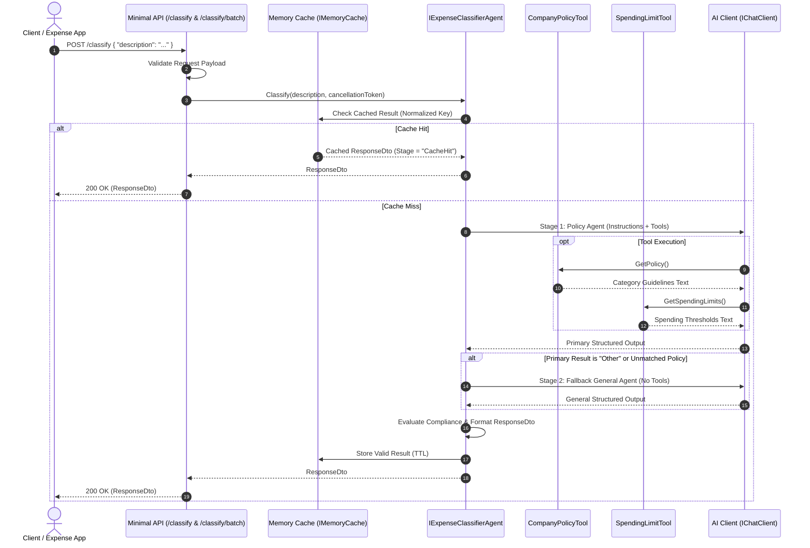

# Enterprise Expense Classifier & Financial Compliance API
## Hands-On Technical Assessment & Candidate Guide

---

## 1. Executive Summary & Assessment Overview

Welcome to the **Enterprise Expense Classifier & Financial Compliance** hands-on technical assessment.

This repository contains a .NET 10 web service designed to automate corporate expense classification, structured financial entity extraction, and compliance threshold enforcement using **Agentic AI** and **ASP.NET Core Minimal APIs**.

The service exposes two primary endpoints:
1. `POST /classify` — Receives an individual free-form employee expense claim (e.g., *"Bolt ride from Murtala Muhammed Airport to Victoria Island costing ₦18,500"*, *"Client dinner meeting at Terra Kulture Restaurant for $180 USD"*), performs intelligent categorization via a two-stage multi-tool agentic workflow, extracts key financial entities (amount, currency, merchant), and checks compliance against company spending limits.
2. `POST /classify/batch` — Receives a collection of expense claims (e.g. from an employee monthly expense report), executes classifications concurrently with bounded parallelism, and returns itemized results alongside aggregated financial metrics.

### Assessment Objective
This repository is a **starter skeleton**. The interface contract `IExpenseClassifierAgent` is defined, but its concrete implementation (`ExpenseClassifierAgent`) has been left unimplemented (`NotImplementedException`). Several critical Dependency Injection (DI) registrations are missing or require configuration review, and caching, batch concurrency, and validation layers must be designed and implemented by you.

**Your mission as a candidate:**
1. **Complete Dependency Injection & Configuration**: Wire up missing tools, agents, cache, and options in `Program.cs`.
2. **Implement Two-Stage Multi-Tool Agentic Pipeline**:
   * **Stage 1 (Policy-Driven Agent with Tool Calling)**: Classify expenses and enforce spending thresholds using tools (`CompanyPolicyTool` and `SpendingLimitTool`).
   * **Stage 2 (Fallback General Classification Agent without Tools)**: When expenses do not match official company policy or result in `"Other"`, invoke a secondary general classification agent (without tools) to identify appropriate categories.
3. **Structured Financial Entity & Metadata Extraction**: Extract amount, ISO currency, merchant, subcategory, confidence score, and compliance status (`Compliant`, `RequiresManagerApproval`, `PolicyViolation`, `Unverifiable`).
4. **Implement High-Performance Cache-Aside**: Check `IMemoryCache` with key normalization, sliding/absolute TTL, and prevention of caching invalid states.
5. **Implement Bounded-Concurrency Batch Processing (`POST /classify/batch`)**: Process batch submissions concurrently without overwhelming upstream AI rate limits, computing summary totals per currency and compliance breakdown.
6. **Harden the API & Pass Test Suite**: Add input validation, cancellation token propagation, structured error handling (RFC 7807 `ProblemDetails`), and verify against the test suite (`dotnet test`).

---

## 2. Business Domain & System Workflow

### 2.1 Domain Context & Policy Rules
Corporate expense claims span rideshares, client dining, regional travel lodging, utility bills, software tooling, and office equipment. The service enforces two layers of governance:
1. **Categorization Policy ([CompanyPolicyTool](file:///c:/Dev/Learning/Interview-Questions/HandsOn/ExpenseClassifier/ExpenseClassifier/Tools/CompanyPolicyTool.cs))**:
   - `Transportation`: Rideshares (Uber, Bolt, Taxi), transit tickets, airport shuttles, flights, vehicle fuel.
   - `Food`: Business meals with clients/partners, team lunches, overtime meals.
   - `Accommodation`: Hotel bookings, serviced apartments for business travel.
   - `Utilities`: Office electricity (IKEDC/EKEDC), broadband data subscriptions (MTN/Airtel/Starlink), water/waste utilities.
   - `Office Supplies`: Stationery, paper, desk peripherals.
   - `Software Subscriptions`: Developer tooling (JetBrains, GitHub, AWS/Azure), SaaS tools (Slack, Zoom, Microsoft 365).
2. **Spending Limits & Thresholds ([SpendingLimitTool](file:///c:/Dev/Learning/Interview-Questions/HandsOn/ExpenseClassifier/ExpenseClassifier/Tools/SpendingLimitTool.cs))**:
   - **Food**: Capped at ₦35,000 NGN / $50 USD per person. Over-limit requires manager approval (`RequiresManagerApproval`). Lavish/excessive (> ₦100,000 / $150) constitutes a `PolicyViolation`.
   - **Transportation**: Standard rideshare capped at ₦25,000 NGN / $30 USD; airport transfers capped at ₦50,000 NGN / $60 USD.
   - **Accommodation**: Standard hotel cap ₦180,000 NGN / $200 USD per night. Luxury tiers require approval (`RequiresManagerApproval`).
   - **Software Subscriptions**: Individual licenses under $100 USD are pre-approved; annual/enterprise tiers require IT approval (`RequiresManagerApproval`).

### 2.2 System Workflow Diagram



---

## 3. Architecture & Technology Stack

| Layer / Concern | Technology / Library | Role in Application |
|---|---|---|
| **Runtime & SDK** | .NET 10 (`net10.0`, C# 13/14) | High-performance runtime with nullable reference types and modern C# idioms. |
| **Web Framework** | ASP.NET Core Minimal APIs | Lightweight HTTP endpoint routing, parameter binding, and response filtering. |
| **AI Abstractions** | `Microsoft.Extensions.AI` | Unified AI abstractions (`IChatClient`, `ChatMessage`, `ChatOptions`, `AIFunctionFactory`). |
| **Agent Framework** | `Microsoft.Agents.AI` | Agentic orchestration and tool-augmented generation pipeline. |
| **AI Client SDK** | `Azure.AI.OpenAI` | Official client for connecting to Azure OpenAI deployments. |
| **Testing & CI** | xUnit & `SimulationChatClient` | Deterministic offline test suite & simulation mode for local grading. |
| **Caching** | `Microsoft.Extensions.Caching.Memory` | In-process cache-aside store with key normalization. |
| **Dependency Injection** | `Microsoft.Extensions.DependencyInjection` | IoC container for service registration and lifetime management. |

---

## 4. Current Codebase Structure

```
ExpenseClassifier/
│
├── ExpenseClassifier.slnx               # Solution file
├── NOTES.md                            # Candidate architecture & design notes (fill this in!)
│
├── ExpenseClassifier/                  # Main Web API Project
│   ├── ExpenseClassifier.csproj        # Project configuration & dependencies
│   ├── Program.cs                      # Entry point, DI container setup, and endpoint routes
│   ├── appsettings.json                # Configuration settings (Azure OpenAI + Simulation Mode)
│   ├── appsettings.Development.json    # Development logging configurations
│   │
│   ├── Models/
│   │   └── RequestDto.cs               # Data contracts (Single & Batch requests, ResponseDto, BatchSummary)
│   │
│   ├── Services/
│   │   ├── ExpenseClassifierAgent.cs   # IExpenseClassifierAgent interface & skeleton implementation
│   │   └── SimulationChatClient.cs     # Deterministic offline IChatClient simulation for local testing
│   │
│   └── Tools/
│       ├── CompanyPolicyTool.cs        # Category classification guidelines tool
│       └── SpendingLimitTool.cs        # Spending limits & financial compliance tool
│
└── ExpenseClassifier.Tests/            # Automated Unit & Integration Tests
    ├── ExpenseClassifier.Tests.csproj  # Test project file
    ├── SimulationChatClientTests.cs    # Entity extraction and compliance test fixtures
    ├── PolicyAndSpendingLimitToolTests.cs # Tool content verification tests
    └── BatchContractTests.cs           # Batch contract and summary calculation tests
```

---

## 5. Candidate Assessment Tasks

### Task 1: Complete Dependency Injection & Service Setup
* Review [Program.cs](file:///c:/Dev/Learning/Interview-Questions/HandsOn/ExpenseClassifier/ExpenseClassifier/Program.cs).
* Ensure all required services are registered in the DI container (`IServiceCollection`):
  * `CompanyPolicyTool` and `SpendingLimitTool`
  * `IMemoryCache` via `AddMemoryCache()`
  * `IChatClient` (configured for live Azure OpenAI or `SimulationChatClient` based on `"ExpenseClassifier:UseSimulation"`)
  * `IExpenseClassifierAgent` registered as `ExpenseClassifierAgent` with appropriate lifetime.
* Ensure no captive dependencies or redundant object creations occur per request.

### Task 2: Implement Multi-Stage & Multi-Tool `IExpenseClassifierAgent`
* Implement `Classify(...)` in [ExpenseClassifierAgent.cs](file:///c:/Dev/Learning/Interview-Questions/HandsOn/ExpenseClassifier/ExpenseClassifier/Services/ExpenseClassifierAgent.cs).
* **Stage 1 (Policy-Driven Agent with Tool Calling)**:
  * Provide system instructions directing the model to classify expenses according to company policy.
  * Bind `CompanyPolicyTool` and `SpendingLimitTool` via function/tool calling.
* **Stage 2 (Fallback General Agent without Tools)**:
  * If the primary agent returns `"Other"` or fails to match standard policy categories, invoke the fallback agent configured for general classification **without** tools.
* **Structured Output & Entity Extraction**:
  * Ensure the output extracts:
    - `Category` & `SubCategory`
    - `ExtractedAmount` (numeric decimal value)
    - `Currency` (ISO-4217, e.g. `NGN`, `USD`, `EUR`, `GBP`)
    - `Merchant` (e.g. `Bolt`, `Terra Kulture`, `Eko Hotel & Suites`, `IKEDC`, `MTN`, `JetBrains`)
    - `ConfidenceScore` (0.0 to 1.0)
    - `ComplianceStatus` (`Compliant`, `RequiresManagerApproval`, `PolicyViolation`, `Unverifiable`)
    - `ComplianceNotes` (explanation if limits are exceeded)
    - `ClassificationStage` (`PolicyAgentWithTools`, `FallbackGeneralAgent`, or `CacheHit`)
* **Performance**: Avoid per-request tool reflection, prompt re-compilation, or redundant agent allocations.

### Task 3: Implement High-Performance Cache-Aside
* Check `IMemoryCache` prior to any AI invocation.
* **Key Normalization**: Sanitize cache keys (trim whitespace, lowercase, handle punctuation/spacing) so that variations like `" Bolt ride to Victoria Island "` and `"bolt ride to victoria island"` hit the cache.
* **Safe Storage**: Do not cache null, malformed, or failed states.
* Set `ClassificationStage = "CacheHit"` when returning from cache.
* Configure an appropriate expiration policy (e.g. 30 minutes absolute or sliding TTL).

### Task 4: Implement High-Throughput Batch Processing (`POST /classify/batch`)
* Implement `ClassifyBatch(...)` in [ExpenseClassifierAgent.cs](file:///c:/Dev/Learning/Interview-Questions/HandsOn/ExpenseClassifier/ExpenseClassifier/Services/ExpenseClassifierAgent.cs).
* Accept `BatchExpenseRequest` containing multiple expense line items.
* Execute classifications concurrently using bounded parallelism (`Parallel.ForEachAsync` or `SemaphoreSlim` with configurable max concurrency, e.g. 5) to respect upstream AI rate limits.
* Aggregate summary analytics into `BatchSummary`:
  * `TotalItems`
  * `CompliantCount`
  * `RequiresApprovalCount`
  * `PolicyViolationCount`
  * `TotalAmountByCurrency` (sum per currency, e.g. `{"NGN": 55000, "USD": 180}`)
  * `ProcessingTimeMs`

### Task 5: API Robustness, Validation, RFC 7807 & Test Suite
* Validate all request payloads; return RFC 7807 `ProblemDetails` for empty/invalid descriptions or empty batch item lists.
* Propagate `CancellationToken` throughout all asynchronous calls.
* Eliminate all compiler warnings under `<Nullable>enable</Nullable>`.
* Ensure all tests pass with `dotnet test`.

---

## 6. Offline Simulation Mode vs Live Azure OpenAI

To facilitate offline development without incurring Azure OpenAI API costs or requiring private API keys, this repository includes a built-in `SimulationChatClient`.

In [appsettings.json](file:///c:/Dev/Learning/Interview-Questions/HandsOn/ExpenseClassifier/ExpenseClassifier/appsettings.json):
* Set `"ExpenseClassifier:UseSimulation": true` to use the deterministic offline simulation client.
* Set `"ExpenseClassifier:UseSimulation": false` and provide your `"AzureOpenAI:Endpoint"` and `"AzureOpenAI:ApiKey"` to connect to live Azure OpenAI.

Both modes adhere strictly to `Microsoft.Extensions.AI.IChatClient`.

---

## 7. Sample API Requests & Expected Responses

### Example 1: Single Transportation Claim (Compliant Policy Match)
**Request:**
```http
POST /classify
Content-Type: application/json

{
  "description": "Bolt ride from Murtala Muhammed Airport to Victoria Island office costing ₦15,000"
}
```
**Response (200 OK):**
```json
{
  "category": "Transportation",
  "subCategory": "Airport Transfer",
  "extractedAmount": 15000.0,
  "currency": "NGN",
  "merchant": "Bolt",
  "confidenceScore": 0.98,
  "complianceStatus": "Compliant",
  "complianceNotes": "Expense is within standard company policy limits.",
  "classificationStage": "PolicyAgentWithTools",
  "expenseDescription": "Bolt ride from Murtala Muhammed Airport to Victoria Island office costing ₦15,000"
}
```

---

### Example 2: Single Dining Claim (Requires Manager Approval)
**Request:**
```http
POST /classify
Content-Type: application/json

{
  "description": "Client dinner meeting at Terra Kulture Restaurant Victoria Island Lagos for ₦45,000"
}
```
**Response (200 OK):**
```json
{
  "category": "Food",
  "subCategory": "Client Dining",
  "extractedAmount": 45000.0,
  "currency": "NGN",
  "merchant": "Terra Kulture",
  "confidenceScore": 0.98,
  "complianceStatus": "RequiresManagerApproval",
  "complianceNotes": "Meal expense exceeds standard ₦35,000 / $50 per-person allowance; requires manager sign-off.",
  "classificationStage": "PolicyAgentWithTools",
  "expenseDescription": "Client dinner meeting at Terra Kulture Restaurant Victoria Island Lagos for ₦45,000"
}
```

---

### Example 3: Fallback General Classification (Software Subscription)
**Request:**
```http
POST /classify
Content-Type: application/json

{
  "description": "Annual JetBrains Rider IDE team license renewal for software engineers $650 USD"
}
```
**Response (200 OK):**
```json
{
  "category": "Software Subscriptions",
  "subCategory": "Developer Tooling",
  "extractedAmount": 650.0,
  "currency": "USD",
  "merchant": "JetBrains",
  "confidenceScore": 0.88,
  "complianceStatus": "Compliant",
  "complianceNotes": "Expense is within standard company policy limits.",
  "classificationStage": "FallbackGeneralAgent",
  "expenseDescription": "Annual JetBrains Rider IDE team license renewal for software engineers $650 USD"
}
```

---

### Example 4: Batch Expense Classification (`POST /classify/batch`)
**Request:**
```http
POST /classify/batch
Content-Type: application/json

{
  "department": "Engineering",
  "employeeId": "EMP-9402",
  "items": [
    { "id": "1", "description": "Bolt ride to office ₦8,500" },
    { "id": "2", "description": "Team lunch at Bukka Hut ₦42,000" },
    { "id": "3", "description": "Monthly MTN 5G Broadband data subscription ₦35,000" },
    { "id": "4", "description": "GitHub Copilot monthly subscription $19 USD" }
  ]
}
```
**Response (200 OK):**
```json
{
  "summary": {
    "totalItems": 4,
    "compliantCount": 3,
    "requiresApprovalCount": 1,
    "policyViolationCount": 0,
    "totalAmountByCurrency": {
      "NGN": 85500.0,
      "USD": 19.0
    },
    "processingTimeMs": 245
  },
  "results": [
    {
      "category": "Transportation",
      "subCategory": "Rideshare",
      "extractedAmount": 8500.0,
      "currency": "NGN",
      "merchant": "Bolt",
      "confidenceScore": 0.98,
      "complianceStatus": "Compliant",
      "complianceNotes": "Expense is within standard company policy limits.",
      "classificationStage": "PolicyAgentWithTools",
      "expenseDescription": "Bolt ride to office ₦8,500"
    },
    {
      "category": "Food",
      "subCategory": "Team Meal",
      "extractedAmount": 42000.0,
      "currency": "NGN",
      "merchant": "Bukka Hut",
      "confidenceScore": 0.98,
      "complianceStatus": "RequiresManagerApproval",
      "complianceNotes": "Meal expense exceeds standard ₦35,000 / $50 per-person allowance; requires manager sign-off.",
      "classificationStage": "PolicyAgentWithTools",
      "expenseDescription": "Team lunch at Bukka Hut ₦42,000"
    },
    {
      "category": "Utilities",
      "subCategory": "Internet Subscription",
      "extractedAmount": 35000.0,
      "currency": "NGN",
      "merchant": "MTN",
      "confidenceScore": 0.98,
      "complianceStatus": "Compliant",
      "complianceNotes": "Expense is within standard company policy limits.",
      "classificationStage": "PolicyAgentWithTools",
      "expenseDescription": "Monthly MTN 5G Broadband data subscription ₦35,000"
    },
    {
      "category": "Software Subscriptions",
      "subCategory": "Developer Tooling",
      "extractedAmount": 19.0,
      "currency": "USD",
      "merchant": "GitHub",
      "confidenceScore": 0.88,
      "complianceStatus": "Compliant",
      "complianceNotes": "Expense is within standard company policy limits.",
      "classificationStage": "FallbackGeneralAgent",
      "expenseDescription": "GitHub Copilot monthly subscription $19 USD"
    }
  ]
}
```

---

## 8. Candidate Evaluation & Grading Rubric

| Dimension | Junior / Associate (1-2) | Mid-Level (3) | Senior Engineer (4) | Staff / Lead Architect (5) |
|---|---|---|---|---|
| **DI & Architecture Setup** | Incomplete service registrations; runtime resolution exceptions. | Registers all missing services cleanly with working configuration. | Evaluates service lifetimes and dependencies thoughtfully; avoids captive dependencies and redundant allocations. | Elegant DI architecture, strongly typed options pattern, support for Managed Identity, and clean modular structure. |
| **Multi-Tool Agent Orchestration** | Basic prompt; creates agent per request; misses fallback routing or second tool. | Implements both primary (multi-tool) and fallback (no-tool) stages with structured output. | Pre-builds reusable agents; robust fallback orchestration; handles missing amounts and currency edge cases. | Production-grade prompt architecture, token usage tracking, structured schema validation, and resilience policies. |
| **Batch Concurrency & Aggregation** | Loops sequentially or creates unconstrained tasks risking rate limits. | Implements basic concurrency for batch processing. | Uses bounded parallelism (`Parallel.ForEachAsync` / `SemaphoreSlim`) with configurable concurrency limits; accurate currency aggregation. | Zero-allocation memory awareness, cancellation propagation, and resilient batch partial failure handling. |
| **Caching & Performance** | Naive cache lookup using raw string keys; caches failed states. | Implements cache-aside with TTL. | Normalizes cache keys; prevents null caching; considers stampede defense. | Thread-safe caching, stampede prevention via AsyncLock or HybridCache, zero-allocation memory awareness. |
| **Code Quality & Testing** | Code compiles with warnings; verbose mutable code; skips tests. | Zero compiler warnings; clean nullable reference handling; basic tests pass. | Modern C# idioms (records, primary constructors, pattern matching); adds thorough test coverage. | Enterprise-grade test fixtures, mock AI abstractions, RFC 7807 problem details, and flawless documentation in `NOTES.md`. |

---

## 9. Submission Guidelines

1. **GitHub Repository**: Push your complete solution and implementation to your personal GitHub repository (public or private with invited access).
2. **Submission Channel**: Send an email back to the recruiting/engineering team containing the direct link to your repository.
3. **Clean Build & Tests**: Ensure your solution builds cleanly with zero errors and zero warnings (`dotnet build`) and all tests pass (`dotnet test`).
4. **Commit History**: Commit incrementally with clear, descriptive commit messages demonstrating your step-by-step engineering thought process.
5. **Candidate Notes**: Complete the [NOTES.md](file:///c:/Dev/Learning/Interview-Questions/HandsOn/ExpenseClassifier/NOTES.md) file detailing your architectural decisions, trade-offs, and future production roadmap.
